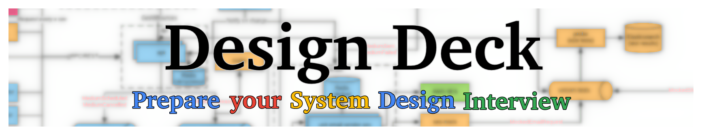
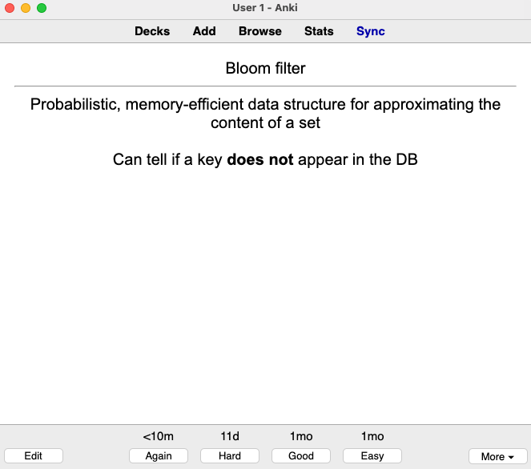

## Overview

Design Deck is an **open-source collection of 230+ system design flash cards**.

It helps you prepare and succeed in your system design interview.

The topics covered are the following:
- [Cache](cache.md): eviction, locations, strategies, when to use a cache, etc.
- [Cloud](cloud.md): main cloud components
- [Database](db.md): ACID, CAP, partitioning, consistency, isolation, denormalization, etc.
- [Design](design.md): general topics such as idempotence, bloom filter, causality, asynchronous communications, vector clocks
- [HTTP](http.md): main HTTP knowledge
- [Kafka](kafka.md): main Kafka building blocks
- [Math](math.md): discrete math
- [Network](network.md): TCP, CORS, ping & heartbeat, OSI, etc.
- [Reliability](reliability.md): reliability patterns
- [Security](security.md): main security knowledge such as TLS, cipher, encryption

## Anki Deck

[Anki](https://apps.ankiweb.net/) is a free software (Windows/Mac/Linux/iPhone/Android) which makes remembering things easy. It utilizes spaced repetition which is a proven technique to increase the rate of memorization:

_Spaced Repetition: The most powerful study technique on YouTube_

> The single biggest change that Anki brings about is that it means memory is no longer a haphazard event, to be left to chance. Rather, it guarantees I will remember something, with minimal effort. That is, Anki makes memory a choice.

test

_Michael A. Nielsen, "Augmenting Long-term Memory"_

Using **Anki is a great way to prepare your algorithm & data structure interview**.
Here is a flashcard example:

The Anki version (a clone of the +200 flashcards from this repo) is available via a one-time GitHub sponsorship tier for $21: [❤️ Sponsor](https://github.com/sponsors/teivah), One-time tab, _Access to the latest Anki deck version of Design Deck_ tier.

## Cards Index

### Cache

* [Cache aside](cache.md#cache-aside)
* [Cache aside vs. read-through](cache.md#cache-aside-vs-read-through)
* [Cache eviction policy](cache.md#cache-eviction-policy)
* [Cache locations](cache.md#cache-locations)
* [Cache: refresh-ahead](cache.md#cache-refresh-ahead)
* [Cache: write through vs. write back](cache.md#cache-write-through-vs-write-back)
* [Four main distributed cache benefits](cache.md#four-main-distributed-cache-benefits)
* [Main metric for cache](cache.md#main-metric-for-cache)
* [Read-through cache](cache.md#read-through-cache)
* [When to use a cache](cache.md#when-to-use-a-cache)

### Cloud

* [CDN](cloud.md#cdn)

### DB

* [3 main reasons to partition data](db.md#3-main-reasons-to-partition-data)
* [ACID property](db.md#acid-property)
* [Anti-entropy](db.md#anti-entropy)
* [Byzantine fault-tolerant](db.md#byzantine-fault-tolerant)
* [CALM theorem](db.md#calm-theorem)
* [CAP theorem](db.md#cap-theorem)
* [Caveat of serializability](db.md#caveat-of-serializability)
* [Chain replication](db.md#chain-replication)
* [Chain replication vs. consensus](db.md#chain-replication-vs-consensus)
* [Change data capture (CDC)](db.md#change-data-capture-cdc)
* [Concurrency control](db.md#concurrency-control)
* [Consensus](db.md#consensus)
* [Consistency models](db.md#consistency-models)
* [CQRS](db.md#cqrs)
* [CRDT](db.md#crdt)
* [CRDT and collaborative applications (e.g., Google Docs)](db.md#crdt-and-collaborative-applications-eg-google-docs)
* [DB indexes tradeoff](db.md#db-indexes-tradeoff)
* [DB internal components](db.md#db-internal-components)
* [DB: read vs. write-heavy, latency vs. consistency, availability vs. consistency, ACID vs. non-ACID](db.md#db-read-vs-write-heavy-latency-vs-consistency-availability-vs-consistency-acid-vs-non-acid)
* [Delta CRDTs](db.md#delta-crdts)
* [Denormalization](db.md#denormalization)
* [Design consideration when partitioning data](db.md#design-consideration-when-partitioning-data)
* [Downside of distributed transactions](db.md#downside-of-distributed-transactions)
* [Event sourcing](db.md#event-sourcing)
* [Eventual consistency requirements](db.md#eventual-consistency-requirements)
* [Examples of solutions offering leader election abstractions](db.md#examples-of-solutions-offering-leader-election-abstractions)
* [Federation](db.md#federation)
* [Fencing token](db.md#fencing-token)
* [Gossip protocol](db.md#gossip-protocol)
* [Graph DB main use case](db.md#graph-db-main-use-case)
* [Hinted handoff](db.md#hinted-handoff)
* [Hot spot in partitioning](db.md#hot-spot-in-partitioning)
* [In a database, strategy to handle rebalancing](db.md#in-a-database-strategy-to-handle-rebalancing)
* [Isolation levels](db.md#isolation-levels)
* [Known CRDTs](db.md#known-crdts)
* [Last-write-wins (LWW)](db.md#last-write-wins-lww)
* [Leader election](db.md#leader-election)
* [LSM tree](db.md#lsm-tree)
* [LSM tree vs. B-tree](db.md#lsm-tree-vs-b-tree)
* [Main difference between consistency models and isolation levels](db.md#main-difference-between-consistency-models-and-isolation-levels)
* [Merkle tree](db.md#merkle-tree)
* [Monotonic reads consistency implementation](db.md#monotonic-reads-consistency-implementation)
* [MVCC](db.md#mvcc)
* [N+1 select problem](db.md#n1-select-problem)
* [NoSQL: main types and main architecture principles](db.md#nosql-main-types-and-main-architecture-principles)
* [Operation-based CRDTs](db.md#operation-based-crdts)
* [Operational transformation (OT): concept and main drawback](db.md#operational-transformation-ot-concept-and-main-drawback)
* [Optimistic concurrency control: pros and cons](db.md#optimistic-concurrency-control-pros-and-cons)
* [PACELC theorem](db.md#pacelc-theorem)
* [Partitioning (sharding)](db.md#partitioning-sharding)
* [Partitioning criteria](db.md#partitioning-criteria)
* [Partitioning methods](db.md#partitioning-methods)
* [Quorum](db.md#quorum)
* [Raft](db.md#raft)
* [Read repair](db.md#read-repair)
* [Relation between replication factor, write consistency and read consistency](db.md#relation-between-replication-factor-write-consistency-and-read-consistency)
* [Replication vs. partition: impacts](db.md#replication-vs-partition-impacts)
* [Schema-on-read vs. schema-on-write](db.md#schema-on-read-vs-schema-on-write)
* [Serializability](db.md#serializability)
* [Serializable Snapshot Isolation (SSI)](db.md#serializable-snapshot-isolation-ssi)
* [Single-leader, multi-leader, leaderless replication](db.md#single-leader-multi-leader-leaderless-replication)
* [Sloppy quorum](db.md#sloppy-quorum)
* [Snapshot Isolation (SI)](db.md#snapshot-isolation-si)
* [Snapshot Isolation common implementation](db.md#snapshot-isolation-common-implementation)
* [SSTable](db.md#sstable)
* [State-based CRDTs: definition and requirements](db.md#state-based-crdts-definition-and-requirements)
* [Strong eventual consistency: definition and requirements](db.md#strong-eventual-consistency-definition-and-requirements)
* [Three-phase commit (3PC)](db.md#three-phase-commit-3pc)
* [Transaction](db.md#transaction)
* [Two main approaches to partition a table that has secondary indexes](db.md#two-main-approaches-to-partition-a-table-that-has-secondary-indexes)
* [Two types of CRDTs](db.md#two-types-of-crdts)
* [Two-phase commit (2PC)](db.md#two-phase-commit-2pc)
* [WAL](db.md#wal)
* [When relational vs. when document](db.md#when-relational-vs-when-document)
* [When to use a column-oriented store](db.md#when-to-use-a-column-oriented-store)
* [Why DB schemaless is misleading](db.md#why-db-schemaless-is-misleading)
* [Why is in-memory faster](db.md#why-is-in-memory-faster)
* [Write and read amplification](db.md#write-and-read-amplification)
* [Write heavy and replication type](db.md#write-heavy-and-replication-type)

### Design

* [Auditing](design.md#auditing)
* [Backward vs. forward compatibility](design.md#backward-vs-forward-compatibility)
* [Bloom filter](design.md#bloom-filter)
* [Causality](design.md#causality)
* [Concurrent operations](design.md#concurrent-operations)
* [Consistent hashing](design.md#consistent-hashing)
* [Design impacts of sharing](design.md#design-impacts-of-sharing)
* [Design: read-heavy vs. write-heavy impacts](design.md#design-read-heavy-vs-write-heavy-impacts)
* [Different types of message failure](design.md#different-types-of-message-failure)
* [Event log vs. message queue](design.md#event-log-vs-message-queue)
* [Exactly-once delivery](design.md#exactly-once-delivery)
* [FLP impossibility](design.md#flp-impossibility)
* [Geohashing](design.md#geohashing)
* [Hashing definition and size of MD5 and SHA256](design.md#hashing-definition-and-size-of-md5-and-sha256)
* [HDFS](design.md#hdfs)
* [How to reduce sharing](design.md#how-to-reduce-sharing)
* [HyperLogLog](design.md#hyperloglog)
* [Idempotent](design.md#idempotent)
* [Latency numbers every programmer should know](design.md#latency-numbers-every-programmer-should-know)
* [Lease](design.md#lease)
* [Least loaded endpoint load balancing strategy](design.md#least-loaded-endpoint-load-balancing-strategy)
* [Liveness property](design.md#liveness-property)
* [Load balancing](design.md#load-balancing)
* [Load shedding](design.md#load-shedding)
* [Locality](design.md#locality)
* [Log](design.md#log)
* [Log compaction](design.md#log-compaction)
* [Main drawback of shared-nothing architectures](design.md#main-drawback-of-shared-nothing-architectures)
* [MapReduce](design.md#mapreduce)
* [Microservices: pros and cons](design.md#microservices-pros-and-cons)
* [Number of values to generate to reach 50% chances of collision: 32-bit, 64-bit, and 128-bit hash](design.md#number-of-values-to-generate-to-reach-50-chances-of-collision-32-bit-64-bit-and-128-bit-hash)
* [Orchestration vs. choreography](design.md#orchestration-vs-choreography)
* [Outbox pattern](design.md#outbox-pattern)
* [Perfect hashing](design.md#perfect-hashing)
* [Quadtree](design.md#quadtree)
* [Rate-limiting (throttling): definition and algos](design.md#rate-limiting-throttling-definition-and-algos)
* [Rebalancing](design.md#rebalancing)
* [REST](design.md#rest)
* [REST vs. gRPC](design.md#rest-vs-grpc)
* [Safety property](design.md#safety-property)
* [Saga](design.md#saga)
* [Scalability](design.md#scalability)
* [Scalability ceiling](design.md#scalability-ceiling)
* [Shared-nothing architectures](design.md#shared-nothing-architectures)
* [Source of truth](design.md#source-of-truth)
* [Split-brain](design.md#split-brain)
* [Throughput](design.md#throughput)
* [Total vs. partial order](design.md#total-vs-partial-order)
* [UUID](design.md#uuid)
* [Validation vs. verification](design.md#validation-vs-verification)
* [Vector clock](design.md#vector-clock)
* [Why asynchronous communication](design.md#why-asynchronous-communication)

### HTTP

* [301 vs. 302](http.md#301-vs-302)
* [403 or 404?](http.md#403-or-404)
* [Cookie](http.md#cookie)
* [Four main HTTP/2 features](http.md#four-main-http2-features)
* [HLS](http.md#hls)
* [HTTP](http.md#http)
* [HTTP cache-control header](http.md#http-cache-control-header)
* [HTTP Etag](http.md#http-etag)
* [HTTP keep-alive](http.md#http-keep-alive)
* [HTTP methods: safeness and idempotence](http.md#http-methods-safeness-and-idempotence)
* [HTTP safe method](http.md#http-safe-method)
* [HTTP status code 429](http.md#http-status-code-429)
* [HTTP status codes](http.md#http-status-codes)
* [What happens if you type google.com in your browser](http.md#what-happens-if-you-type-googlecom-in-your-browser)

### Kafka

* [Consumer types](kafka.md#consumer-types)
* [Durability/availability and latency/throughput tradeoffs](kafka.md#durabilityavailability-and-latencythroughput-tradeoffs) 
* [Log compaction](kafka.md#log-compaction)
* [Offset](kafka.md#offset)
* [Partition](kafka.md#partition)
* [Partition distribution](kafka.md#partition-distribution)
* [Rebalancing](kafka.md#rebalancing)
* [Segment](kafka.md#segment)
* [Shared subscription](kafka.md#shared-subscription)

### Math

* [Associative property](math.md#associative-property)
* [Commutative property](math.md#commutative-property)
* [Harmonic mean](math.md#harmonic-mean)

### Network

* [ARP protocol](network.md#arp-protocol)
* [Average connection speed in USA](network.md#average-connection-speed-in-usa)
* [Backpressure](network.md#backpressure)
* [Bandwidth](network.md#bandwidth)
* [BGP](network.md#bgp)
* [CORS](network.md#cors)
* [Difference ping & heartbeat](network.md#difference-ping--heartbeat)
* [Difference TCP & UDP](network.md#difference-tcp--udp)
* [Difference view & materialized view](network.md#difference-view--materialized-view)
* [DNS](network.md#dns)
* [DNS lookup: push or pull](network.md#dns-lookup-push-or-pull)
* [Health checks: passive vs. active](network.md#health-checks-passive-vs-active)
* [Internet model](network.md#internet-model)
* [Layer 4 vs. layer 7 load balancer](network.md#layer-4-vs-layer-7-load-balancer)
* [MAC address](network.md#mac-address)
* [Max size of a TCP packet](network.md#max-size-of-a-tcp-packet)
* [MQTT LWT](network.md#mqtt-lwt)
* [NTP](network.md#ntp)
* [OSI model](network.md#osi-model)
* [Routers](network.md#routers)
* [Routers buffering](network.md#routers-buffering)
* [Routers processing](network.md#routers-processing)
* [Routing table](network.md#routing-table)
* [Service mesh](network.md#service-mesh)
* [Switch](network.md#switch)
* [TCP congestion control](network.md#tcp-congestion-control)
* [TCP connection backlog](network.md#tcp-connection-backlog)
* [TCP flow control](network.md#tcp-flow-control)
* [TCP handshake](network.md#tcp-handshake)
* [Websocket](network.md#websocket)
* [Why can't we rely on the system clock in distributed systems?](network.md#why-cant-we-rely-on-the-system-clock-in-distributed-systems)

### Reliability

* [Bulkhead pattern](reliability.md#bulkhead-pattern)
* [Cascading failure](reliability.md#cascading-failure)
* [Causal consistency implementation](reliability.md#causal-consistency-implementation)
* [Circuit breaker](reliability.md#circuit-breaker)
* [Exponential backoff](reliability.md#exponential-backoff)
* [Fault tolerance](reliability.md#fault-tolerance)
* [Jitter](reliability.md#jitter)
* [Knee point](reliability.md#knee-point)
* [Phi-accrual failure detector](reliability.md#phi-accrual-failure-detector)
* [Retry amplification](reliability.md#retry-amplification)

### Security

* [Authentication](security.md#authentication)
* [Certificate authorities](security.md#certificate-authorities)
* [Cipher](security.md#cipher)
* [Confidentiality](security.md#confidentiality)
* [Integrity](security.md#integrity)
* [Mutual TLS](security.md#mutual-tls)
* [OAuth 2](security.md#oauth-2)
* [Public key infrastructure (PKI)](security.md#public-key-infrastructure-pki)
* [TLS handshake](security.md#tls-handshake)
* [Two main uses of encryption](security.md#two-main-uses-of-encryption)
* [Two types of encryption](security.md#two-types-of-encryption)
* [What does digital signature provide](security.md#what-does-digital-signature-provide)
* [What does TLS provide?](security.md#what-does-tls-provide)

## References

* [Designing Data-Intensive Applications](https://dataintensive.net/)
* [Understanding Distributed Systems](https://understandingdistributed.systems/)
* [Distributed Systems for practitioners](https://leanpub.com/distributed-systems-for-practitioners)

## Additional Notes

If you're preparing an algorithm & data structure interview, you can take a look at [Algo Deck](https://github.com/teivah/algodeck/)
