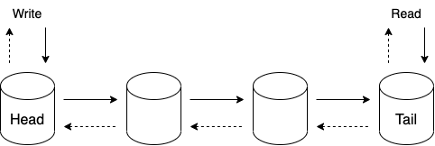
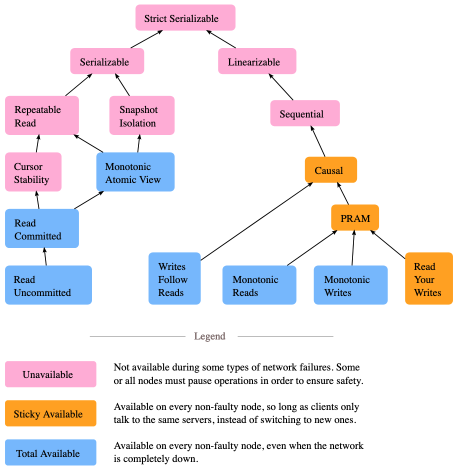

# DB

## ACID property

Atomic: all transaction succeeds or none does (all or nothing)

Consistency: from one valid state to another (invariants must always be true)

Not necessarily a property of the DB (e.g. foreign key constraint), can be a property of the application (e.g. credits and debits must be balanced)

!= consistency in eventual consistency (which is more about convergence as the matter is replicating data)

Isolation: a transaction is not affected by another ongoing transaction (a transaction cannot read from another transaction that has not yet completed)

Durability: once a transaction is committed, it will remain in the system

## Byzantine fault-tolerant

A system is Byzantine fault-tolerant if it continues to operate correctly if in the case of a Bizantine's problem (some of the nodes malfunctioning, not obeying the protocol or malicious attackers).

## CALM theorem

A program has a consistent, coordination-free (e.g., consensus-free) distributed implementation if and only if it is monotonic

Consistency in this context doesn't mean linearizability. It focuses on the consistenct of the program's output while traditional consistency focus on the consistency of reads and writes.

In CALM, a consistent program is one that produces the same output no matter in which order the inputs are processed and despite any conflicts. Said differently, does the implementation produce the outcome we expect despite any race condition that may arise.

## CAP theorem

Consistency, availability, partition tolerance (e.g. one node cut off from the rest of the cluster because of a network partition) => pick 2 out of 3

## Causal consistency

Eventual consistency doesn't guarantee causality (an operation that happened before another is observed in the correct order by all replicas)

To preserve causality, we don't necessarily need to reach for strong consistency, the weaker is the causal consistency model

Implementation: when a replica receives a new write, it doesn't apply it locally immediately. First, it checks whether the write's dependencies have been committed locally. If not, it waits until the required version appear.

Strongest consistency model that solves the CAP theorem

## Chain replication

Replication protocol that uses a different topology than leader based replication protocols like Raft

Left-most process referred as the chain's head, right-most as the chain's tail:
- Client send writes to the head, which updates its local state and forwards to the next process in the chain
- Next process updates its local state and forwards to the next process in the chain
- Etc.
- Once the update is received by the tail, the ack flows back to the head which reply to the client that the write succeeded

Fault tolderance is delegated to a dedicated component: control plane
- If head fail: the control plane removes it and makes the next as the head
- If intermediate process X fail: the control plane removes it and creates a new link between X's predecessor and X's successor
- If tail fails: the control plane removes it and makes the the predecessor as the new tail

Benefits:
- Strongly consistent protocol.
- Reads are served from the tail without contacting other replicas first which allors a lower response time.

Drawbacks:
- A single slow node can slow down all writes.
- As reads are served from a single node, it can't be scaled horizontaly. A mitigation is to allow intermediate nodes to serve reads but they can do it only if a read is considered as clean (the ack for this object has been returned to the predecessor).

## Concurrency control

Ensures that correct results for concurrent operations are generated

Pessimistic: lock

Optimistic: checkes for conflicts at the end of a transaction

In the end, concurrency control serves the same purpose than atomicity

## Consensus

Set of processes agreeing on some data value in a fault-tolerant way

## Consistency models

Describe what expectations clients might have in terms of possible returned values despite the existence of multiple copies of data and concurrent accesses to it

Not really the C in ACID, but more about convergence

Source: [Jepsen Consistency Models](https://jepsen.io/consistency)

## Consistent prefix reads

Guarantee that if a sequence of write happens in a certain order, then anyone reading those writes will see them appear in the same order

## CQRS

Command Query Responsibility Segregation

Dissociates dissociate writes (command) from reads (query)

Pros:
- Allows to create stores per use case (e.g., analytics, geospatial)
- Scale the read part independently

Cons:
- Eventual consistency between the stores

## CRDT

Conflict-free Replicated Data Types

Data structure that can be replicated across nodes, where the replicas can be updated independently and concurrently without coordination between the replicas

Properties:
- Object's states form a semilattice (a set that contains elements that can be partially ordered)
- The merge operation returns the least upper bound between two object's state
  Example: register, counter, sets, dictionaries, graph

Allows to solve conflicts and achieve strong eventual consistency without concensus

## DB indexes tradeoff

Speed up read query but slow down writes

## DB internal components

- Transport layer accepting requests
- Query processor determining the most efficient way to run queries
- Execution engine
- Storage engine

## Denormalization

Introduce some amount of duplication in a normalized dataset in order to speed up reads (e.g. denormalized document, cache or index)

Cons:
- Requires more space
- May slow down write as data may need to be added/modified in different tables

## Difference view & materialized view

A view is just an abstraction (SQL request is rewritten to match the actual schema)

A materialized view is a copy (written to disk)

## Dirty read

Isolation problem

A transaction observes a write from a transaction that hasn't been completed yet

## Dirty write

Isolation problem

A transaction overwrites the value written by another transaction that hasn't been committed yet

## Document vs relational

Document (schema-on-read):
- Schema flexibility
- Better performance due to locality
- Closer to the data structures used by the application
- Not necessarily ACID

Relational (schema-on-write):
- Better support for joins
- Many-to-one and many-to-many relationships
- ACID

## Document-partitioned vs term-partitioned indexes

Document-partitioned indexes:
- Secondary indexes stored in the same partition as the record itself
- Write: on one partition
- Query on the index: requires to query multiple partitions

Example: Elasticsearch, MongoDB, Canssandra, Riak, etc.

Term-partitioned indexes:
- Instead of each partition having its own secondary index, we can construct a global index that covers data in all partitions. The term we're looking for determines the partition of the index
- Write: multiple partitions are updated (the index is replicated for resiliency)
- Query on the index: served from one partition

## Downside of distributed transactions

Performance penalty

Example: distributed transactions in MySQL are reported to be over 10 times slower than single-node transactions

## Event sourcing

Ensures that all changes to application state are stored as a sequence of events

## Eventual consistency

Weaker form of consistency

The only guarantee is that eventually, all the followers will converge to the final state

Requires:
- Eventual delivery: every update applied at a replica is eventually applied to all replicas
- Convergence: guarantees that replicas have applied the same updates eventually reach the same state

## Examples of solutions offering leader election abstractions

etcd and ZooKeeper (linearizable key-value stores)

## Federation

Splits up DB by function

## Fencing token

Monotonically increasing token that increments whenever a client acquires a distributed lock

## Fuzzy read

Isolation problem

A transaction reads a value twice but sees a different value in each read because a committed transaction updated the value between the two reads

## Gossip protocol

Peer-to-peer protocol based on the way epidemics spread

No central registry and the only way to spread common data is to rely on each member to pass it along to their neighbors

Useful when broadcasting to a large number of processes like thousands or more, where a deterministic protocol wouldn't scale

## Graph DB main use case

Relational can handle simple cases of many-to-many relationships

Yet, if the connections become more complex, it's more natural to start modeling data as a graph

## Hot spot in partitioning

Partition heavily loaded compared to others

Also called skew

## Impedance mismatch

Differences between the DB and the programming language model

## In a database, strategy to handle rebalancing

Not based on key hashing as a rebalancing would be huge

Simple solution: Create many more partitions than nodes and assign several partitions to each node (e.g. a db running on a cluster of 10 nodes may be split into 10k partitions). When a node is added to the cluster, it will steal a few partitions from every existing node

## Isolation level

Degree to which transactions are isolated from other concurrently execution transactions

Isolations comes at a performance cost (more coordination and synchronization)

Source: [Understanding Distributed Systems](https://understandingdistributed.systems/)

## Key range vs hash partitioning

Key range: keys are sorted and a partition owns all the keys from some minimum up to some maximum

Pros: efficient range queries

Cons: Risk of hot spots, requires repartitioning to potentially split a range into two subranges if a partition gets too big

Hash partitioning: hash function is applied to each key and a partition owns a range of hashes

## Knee point

Moment when linear scalability is not possible anymore

## Leader election 

Algorithm to guarantee at most one leader at any given time (safety) and that an election eventually completes (liveness)

## Linearizability

Make a system appear as if
- There is only a single copy of the data
- All operations are atomic (one operation at a time)

Impacts:
- Even though there may be multiple replicas, the application does not need to worry about them
- Monotonic reads
- Prevents stale reads

Also known as strong consistency

## LSM tree

xLog-Structured Merge tree

Consists of smaller mutable memory-resident (memtable) and larger immutable disk-resident (SSTable) components

Memtables data are sorted and flushed on disk when its size reaches a configurable threshold or periodically

Because of a memtable is just a special case of buffer, durability is not guaranteed (durability must be brought by replication)

Examples: Lucene, Cassandra, Bitcask, etc.

## LSM tree vs B-tree

LSM-tree faster for writes, slower for reads because it has to check multiple data structures (bigger read amplification): memtable and SSTable
Compaction can impact ongoing requests

B-tree faster for reads, slower for write as it must write every piece of data at least twice in the WAL & tree itself (bigger write amplification)
Each key exists in exactly one place => easier to offer strong transactional semantics

## Main reasons to partition data

- Scalability
- Faster for reads

## Monotonic reads consistency

Consistency level to guarantee that a user doing several reads in sequence will not go backward in time
It means it will not read older data after having previously read newer data

One way to achieve it is to make sure each user always makes their reads from the same replica

## Monotonic writes

Values originating from the same client appear in the order the client has executed them

## MVCC

Multiversion Concurrency Control

A possible implementation of optimistic concurrency control

Guarantees a consistent view of the DB at some point in the past by allowing multiple timestamped versions of the record to be present

MVCC allows reads and writes to proceed with a minimal coordination on the storage level since reads can continue accessing older values until the new ones are committed

## N+1 select problem

Assuming a one-to-many relationship between 2 tables A and B => A 1-* B

If we want to iterate through all the A and for each one, print the list of B, the naive implementation would be:
- `select * from A`
- And then for each A, `select * from B where A_ID = ?`

Alternatively, we could reduce the number of rount-trips to the DB from N+1 to 2 with a simple `select * from B`

Most ORM tools prevent N+1 selects

## NoSQL

Key-value store, document store, column-oriented store or graph DB

- Mainly partition-based
- Leverage eventual consistency

## Optimistic concurrency control: pros and cons

Perform badly if high contention as it leads to a high proportion of retry, thus make performance worse

If not much contention, it tends to perform better than pessimistic

## PACELC theorem

If case of a network partition (P): we should choose between availability (A) or consistency (C)

Else, in the absence of partition (E): we should choose between latency (L) or consistency (C)

## Partitioning (sharding)

Split up a large dataset that is too big for a single machine into smaller parts and spread them across several machines

Define the partition type based on the primary access pattern

## Phantom read

Isolation problem

A transaction reads a set of objects matching a specific condition, while another transaction adds, updates, or deletes an object matching the same condition

Example: one transaction summing all employee's salary while another deletes some employee record at the same time => sum of salaries will be wrong at commit time

## Quorum

Minimum number of nodes that need to vote on an operation before it can be considered successful

Usually: majority

## Raft

Leader election and replication algorithms

### Leader election

Using a state machine to elect a leader
Each process is in one of these three states: leader, candidate (part of the election process), follower

### Replication

The leader stores the sequence of operations altering the state into a local ordered log

Then, this log is replicated across followers
Each entry is considered as committed when it has been replicated on a majority of nodes

Replication enables concensus

## Read committed consistency

Consistency level that strengthens read uncommitted by preventing dirty reads: transaction are not allowed to observe writes from transactions which do no commit

## Read uncommitted consistency

Consistency level that prohibits dirty writes where two transactions modify the same object concurrently before committing

Clients can see the results of writes before the writes are durable

## Read-after-write consistency

Reading just after a write is consistent

Also known as read-your-writes consistency

## Read-heavy vs. write-heavy impacts

Read heavy:
- Leverage replication
- Denormalize
- B-tree

Write heavy:
- Leverage partition
- Normalize
- LSM tree

## Relation between replication factor, write consistency and read consistency

Given:
- _N_: number of replicas
- _W_: number of nodes that have to ack a write for it to succeed
- _R_: number of nodes that have to respond to a read operation for it to succeeed

If _R_+_W_ > _N_, the system can guarantee returning the most recent written value because there's always an overlap between read and write sets (strong consistency)

Notes:
- In case of read heavy systems, we want to minimize _R_
- If _W_ = 1 and _R_ = _N_, durability isn't guaranteed in the presence of failure
- If _W_ < (_N_+1)/2, it may leads to write conflicts (e.g., _W_ < 2 if 3 nodes)
- If _R_+_W_ <= _N_ => weak/eventual consistency

## Relationship between causality and linearizability

Linearizability implies causality: any system that is linearizable will preserve causality correctly

## Replication or partition?

Replication:
- Read-heavy
- Improves availability but makes consistency heavier

Partition:
- Dataset doesn't fit on a single node
- Write-heavy

## Schema-on-read vs schema-on-write

Schema-on-read: implicit schema but not enforced by the DB (also called schemaless but missleading)

Schema-on-write: explicit schema, the DB ensures all writes are conform to it (e.g. relational DB)

## Serializability

I in ACID (strong isolation level)

Equivalent to serial execution (no interleaving due to concurrent transactions)

Caveat: It's possible that serial order to be different from the order in which transactions were actually run. If not, we need a stricter isolation level: strict serializability (serializability + linearizability).

## Serializable Snapshot Isolation (SSI)

Snapshot Isolation (SI) allows write skew

SSI is a stricter isolation level than SI: check at runtime for conflicts between transactions
Downside: increase the number of aborted transactions

## Snapshot Isolation (SI)

Guarantee that all reads made in a transaction will see a consistent snapshot of the database

In practice, it reads the last committed values that existed at the time it started

Allows write skew

## Split brain

Network partition => nodes unable to communicate with each other => multiple nodes believing they are the leader

As a node is unaware that another node is still functioning, it can lead to data corruption or data loss

## SSTable

Sorted String Table, immutable components of a LSM tree

Sorted immutable data structure

Consists of 2 components: index files and data files

The index (based on a hashtable or a B-tree) holds the keys and the data entries (offsets in the data file where the actual records are located)

Data files hold records in key order

## Strong eventual consistency

Stronger guarantee than eventual consistency

Based on the fact that we can define a deterministic outcome for any conflict

Requires:
- Eventual delivery: every update applied at a replica is eventually applied to all replicas
- Strong convergence: guarantees that replicas that _have_ executed the same updates have the same state (with eventual consistency, the guarantee is that the replicas _eventually_ reach the same state, once concensus is reached)

Strong convergence requires convergent replicated data types (part of CRDT family)

Main difference with eventual consistency:
- Leaderless replication
- No concensus needed, instead, it relies on a deterministic outcome for any conflict

A solution to the CAP theorem

## Synchronous replication in DB

Impracticable for all followers to be synchronous: any one node outage would cause the whole system to be broken

In practice, synchronous replication usually means that one follower is synchronous, the others asynchronous

## Two-phase commit (2PC)

Protocol used to implement atomic transaction commits across multiple processes

## WAL

Write-ahead log (or redo log)

Append-only file to which every modification must be written
Used for restoration in the event of a DB crash

## When to use a column-oriented store

Because columns are store contiguously: analytical workloads (computing average values, finding trends, etc.)

Limited space (storing same data type together offers a better compression ratio)

## Why DB schemaless is misleading

There is an implicit schema but not enforced by the DB
More accurate term: schema-on-read

Different from relational DB with shema-on-write where the schema is explicit and the DB ensures all written data conforms to it

Similar to dynamic vs static type checking in programming language

## Why is a in-memory faster

Not necesseraly because they don't need to read from disk (even a disk-based storage engine may never need to read from disk if enough memory)

Can be faster because they avoid the overhead of encoding in a form that can be written to disk

## Write and read amplification

Ratio of the amount of data written/read to the disk versus the amount of data written to the DB

## Write skew

Two writes to the same column by two different writers resulting in a mix of two transactions

## Write-follows-reads

Ensures that writes are ordered after writes that were observed by previous read operations

Example: if `write(foo, v2)` is ordered after `read(foo)` that returned `v1` => `write(foo, v2)` will be ordered after `write(foo, v1)`

Also referred as session causality
