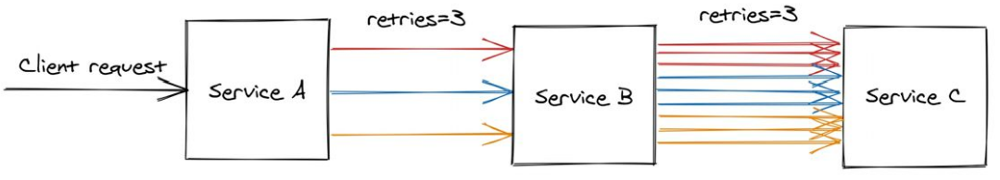

# Reliability

## Bulkhead pattern

Provides guaranteed fault isolation by design

Based on the idea of partitioning a shared resource to isolate failures

## Cascading failure

A process in a system of interconnected parts in which the failure of one or few parts can trigger the failure of other parts and so on

## Causal consistency implementation

When a replica receives a new write, it doesn't apply it locally immediately. First, it checks whether the write's dependencies have been committed locally. If not, it waits until the required version appears.

## Circuit breaker

Used to prevent a network or service failure from cascading to other failures

Implemented on the client-side

Three states:
- Closed: accept requests
- Open: do not accept requests and fail immediately
- Half-open: give the service another chance (can also be implemented using a probe)

The circuit can be opened when the health endpoint of the service is down or when the number of consecutive errors reaches a threshold

## Exponential backoff

Wait time increased exponentially after every retry attempt

## Fault tolerance

Property of a system that can continue operating correctly in the presence of failure of its components

## Jitter

Introduces a part of randomness to avoid synchronized retry spikes experienced during cascading failures

## Knee point

Moment when linear scalability is not possible anymore

## Phi-accrual failure detector

Instead of treating failure node failure as a binary problem (up or down), a phi-accrual failure detector has a continuous scale, capturing the probability of the monitored process's crash

Works by maintaining a sliding window, collecting arrival times of the most recent heartbeats

Used to approximate the arrival time of the next heartbeat and compute a suspicion level (how certain the failure detector is about a failure)

## Retry amplification

Having retries at multiple levels of the dependency chain can amplify the number of retry

The deeper a service in the chain, the higher the load it will be exposed to due to amplification:

In case of a long dependency chain, perhaps we should only retry at a single level of the chain
